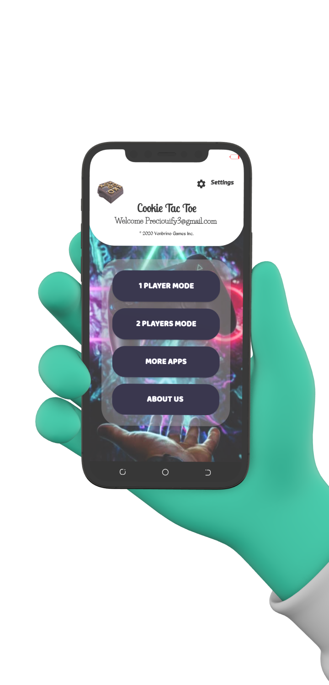

# BackInTime
A cookie tac toe mobile 2d games built won android. 

## Libraries
*   [Gson](https://github.com/google/gson) : An Object-to-JSON serialization/deserialization library
*   [Retrofit](https://square.github.io/retrofit/) : A type-safe HTTP client for Android and Java
*   [Glide](https://github.com/bumptech/glide) : Glide is a fast and efficient open source media management and image loading framework for Android
*   [PhotoView](https://github.com/Baseflow/PhotoView) : PhotoView aims to help produce an easily usable implementation of a zooming Android ImageView.
*   [Firebase]

<h2 align="left">Screenshots</h2>
<h4 align="center">

  
  
## Author
Agalaba Ifeanyi Precious
